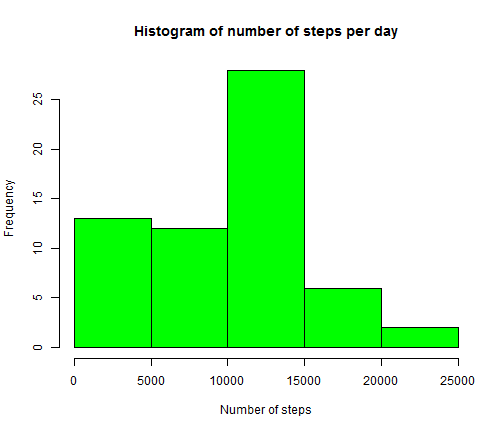
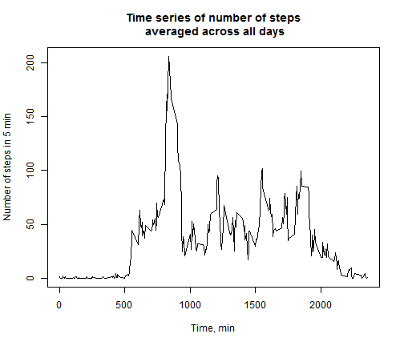
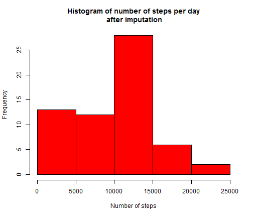
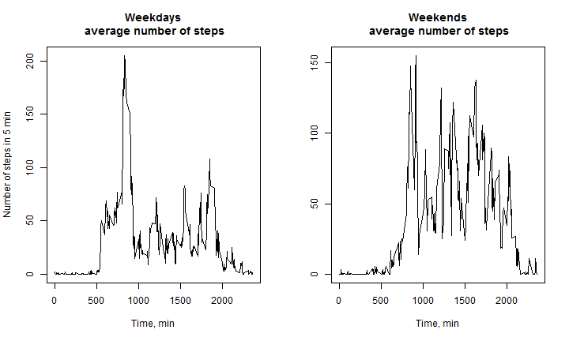

Task 1 Reproducible Research
========================================================

# Loading and preprocessing the data


```r
download.file(url="https://d396qusza40orc.cloudfront.net/repdata%2Fdata%2Factivity.zip", "./dats.zip",method="curl")
```

```
## Warning: running command 'curl  "https://d396qusza40orc.cloudfront.net/repdata%2Fdata%2Factivity.zip"  -o "./dats.zip"' had status 127
## Warning: download had nonzero exit status
```

```r
unzip("./dats.zip")
d<-read.csv("./activity.csv")
d$date<-as.character(d$date)
```


# What is mean total number of steps taken per day?
For this part of the assignment, you can ignore the missing values in the dataset.
- Make a histogram of the total number of steps taken each day
- Calculate and report the mean and median total number of steps taken per day

```r
hist(tapply(d$steps,d$date,sum,na.rm=T),xlab="Number of steps",main="Histogram of number of steps per day", col="green")
```

 

```r
m1<-mean(tapply(d$steps,d$date,sum,na.rm=T),na.rm=T)
m2<-median(tapply(d$steps,d$date,sum,na.rm=T),na.rm=T)
```

### Mean of total number of steps taken per day is 9354.2295
### Median of total number of steps taken per day is 10395

# What is the average daily activity pattern?
- Make a time series plot of the 5-minute interval (x-axis) and the average number of steps taken, averaged across all days (y-axis)
- Which 5-minute interval, on average across all the days in the dataset, contains the maximum number of steps?

```r
y<-tapply(d$steps,d$interval,mean,na.rm=T)
x<-as.numeric(names(y))
plot(x,y,xlab="Time, min",ylab="Number of steps in 5 min",main="Time series of number of steps\n averaged across all days" ,type="l")
```

 

```r
m1<-x[which.max(y)] 
```
### The maximum number of steps, on average across all the days, occured in 5-minute interval between 835 and 840 minutes

# Imputing missing values
- Calculate and report the total number of missing values in the dataset (i.e. the total number of rows with NAs)
- Devise a strategy for filling in all of the missing values in the dataset.
- Create a new dataset that is equal to the original dataset but with the missing data filled in.

```r
m1<-sapply(d,function(x) sum(is.na(x)))
d2<-d
d2$steps<-as.numeric(d2$steps)
d2<-merge(d2, data.frame(steps2=tapply(d2$steps,d2$interval,median,na.rm=T), interval=x), by="interval" )
d2[is.na(d2$steps),"steps"]<-d2[is.na(d2$steps),"steps2"]
d2<-d2[,-4]
```
### Total number of missing values in the dataset is 2304
### d2 is a new dataset, where missing values are imputed as the medians for corresponding 5-minute intervals 

```r
hist(tapply(d2$steps,d2$date,sum,na.rm=T),xlab="Number of steps",main="Histogram of number of steps per day\n after imputation", col="red")
```

 

```r
m1<-mean(tapply(d2$steps,d2$date,sum,na.rm=T),na.rm=T)
m2<-median(tapply(d2$steps,d2$date,sum,na.rm=T),na.rm=T) 
```
### Mean of total number of steps taken per day is 9503.8689
### Median of total number of steps taken per day is 1.0395 &times; 10<sup>4</sup>

### Imputation did not change the median of total number of steps, which makes perfect sense as medians were used for imputation. In contrast, mean was affected.

# Are there differences in activity patterns between weekdays and weekends?
- Create a new factor variable in the dataset with two levels - "weekday" and "weekend" indicating whether a given date is a weekday or weekend day
- Make a panel plot containing a time series plot (i.e. type = "l") of the 5-minute interval (x-axis) and the average number of steps taken, averaged across all weekday days or weekend days (y-axis). 

```r
d2$day<-as.character(weekdays(as.Date(d2$date)))
d2$weekend<-sapply(d2$day, function(x) { 
    if (x %in% c("Saturday","Sunday")){
        "weekend"
    }else{
        "weekday"}})
 
par(mfrow=c(1,2))
temp<-subset(d2, subset=(d2$weekend=="weekday"))
y<-tapply(temp$steps,temp$interval,mean)
x<-as.numeric(names(y))
plot(x,y,xlab="Time, min",ylab="Number of steps in 5 min",main="Weekdays\n average number of steps" ,type="l")
rm(list=c("temp","x","y"))

temp<-subset(d2, subset=(d2$weekend=="weekend"))
y<-tapply(temp$steps,temp$interval,mean)
x<-as.numeric(names(y))
plot(x,y,xlab="Time, min",main="Weekends\n average number of steps" ,ylab="",type="l")
```

 

```r
rm(list=c("temp","x","y"))
```


